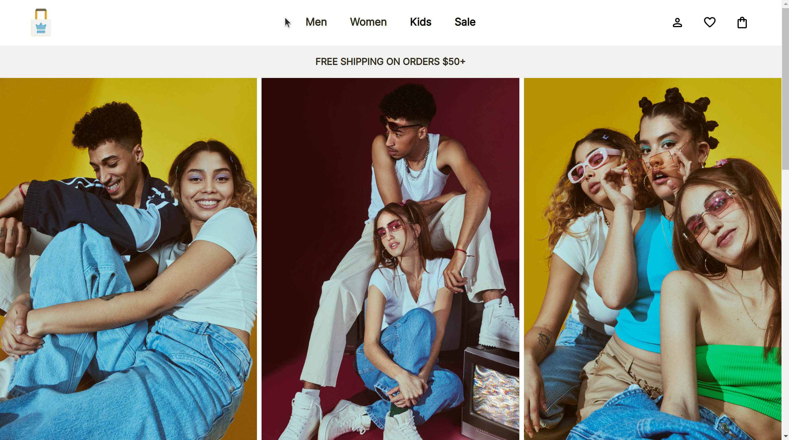
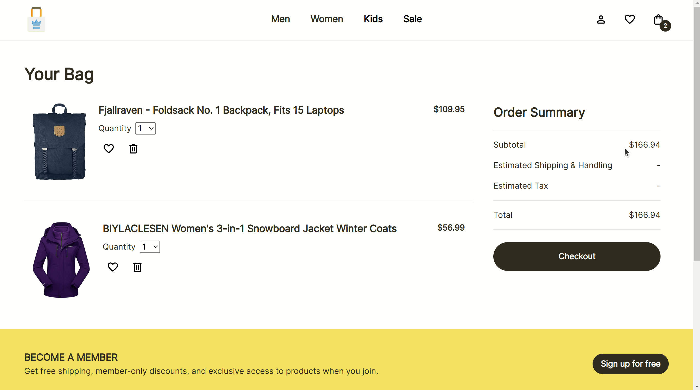
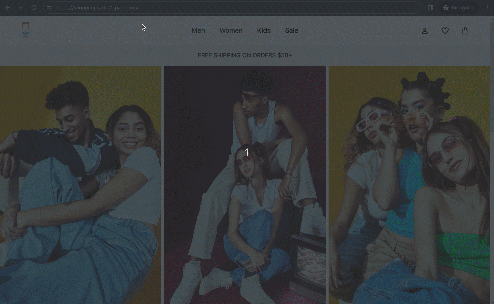

# Shopping Cart

https://shopping-cart-c0j.pages.dev/

## Project Summary

This project, created by The Odin Project, is a mock e-commerce apparel website that offers a seamless online shopping experience. _Urband Thread_ aims to replicate the user experience and interaction of browsing and selecting products while also focusing on implementing key React concepts and practices:

- Client-side routing
  - Enables smooth navigation between pages, simulating the slow of a single-page application.
- Making, managing, and handling API calls
  - Utilizes the `useEffect()` hook to fetch product data from the FakeStore API as well as handle errors, create custom hooks, and optimize performance by preventing multiple fetch requests.
- CSS Modules
  - Locally-scoped styles enhance maintainability and lays a foundation for future learning with CSS frameworks.
- Type checking with PropTypes
  - Introduces type checking to prepare for future learning with TypeScript.
- Testing with Jest/Vitest
  - Ensures code reliability and functionality through comprehensive testing.

## Features Overview

### Navigation

The main source of navigation between pages is located in the header. The user can navigate to the following pages:

- Home page
- Men's shopping page
- Women's shopping page
- Product page
- Shopping bag page

Links to the men's and women's shopping pages are also found on the home page, the shopping bag page (if the bag is empty), and the footer for convenience. The user can navigate to a product page by selecting on any of the product cards displayed in one of the shopping pages.

Demo:

### Product Cards/Pages

Product cards serve as both a way to provide an overview about a product and navigate to the product's specific page. Each product page has additional information and features:

- Product name
- Ratings
- Price
- Description
- "Add to bag" button
- "Favorite" button (not implemented)

**Note**: Adding a product to the shopping bag will increase the number displayed on the shopping bag icon located in the header to reflect changes made to the bag.

Demo:

### Shopping Bag

**<ins>Products Added</ins>**

A condensed product card of each product added to the shopping bag is displayed. The user can make the following interactions:

- Change the quantity of an item
- Remove the entire product from the bag

**Note**: Each of these interactions will update the prices displayed in the "Order Summary."

**<ins>Order Summary</ins>**

An order summary is displayed to simulate the checkout process of e-commerce websites. The "checkout" function is not implemented; only the prices will change based on the number of items in the bag.

**Note**: The shopping bag must have at least 1 item to display the order summary.

Demo:

### 404 Error

If a page is not found, the 404 error page will appear, giving the user the option to return to the home page.

Demo:

### Responsiveness

Media queries are added to provide a satisfactory user experience for mobile, tablet, and computer users.

## Reflection

Through this project, I gained valuable skills in React development that not only enhanced my proficiency in React but also prepared me for future endeavors in web development, including exploring CSS frameworks and transitioning to TypeScript. Because this project is also larger-scaled compared to previous projects, I learned how to better organize my code and set the project up for success in terms of scalability and maintainability.

I also created my first custom hook, which helped me better understand React hooks in general and how custom hooks can improve code reusability and readability. This was my first time using React Router, which added a whole new learning curve, but was definitely worthwhile as it makes navigation easier and smoother.

Creating tests for this project led to many unexpected errors. Through many trial and errors and extensive research on Google and Stack Overflow, I learned how to mock globals, mock `useParams()` to a specific value to test the rendering of a product page based on a product's id, and simulate user interaction of `select` inputs by calling `unmount()` and re-rendering components. I also created utility functions that allow me to render components and set their routes using React Router for easy testing.

This project serves as a testament to my dedication to continuous learning and improvement in the field of web development. With _Urban Thread_, I demonstrated my ability to tackle complex projects while adhering to industry best practices and standards.

## Credits

- Website logo/favicon by Yogi Aprelliyanto on [Freepik](https://www.freepik.com/icon/shopping-bag_6058239#fromView=search&term=clothing+brand&track=ais&page=2&position=3&uuid=fc5a59b2-a128-4174-bb3d-91235123cd9a)
- Miscellaneous icons from [Google Fonts](https://fonts.google.com/)
- Social media icons from Ulcons on [Freepik](https://www.freepik.com/author/uicons/icons/uicons-brands-solid_5089)
- Home page photos from Freepik on [Freepik](https://www.freepik.com/serie/27590780)
- 404 image from storyset on [Freepik](https://www.freepik.com/free-vector/page-found-concept-illustration_7887410.htm#query=404&position=3&from_view=search&track=sph&uuid=b8afd1a0-01cd-4fb4-9649-f11c65c009e3)
